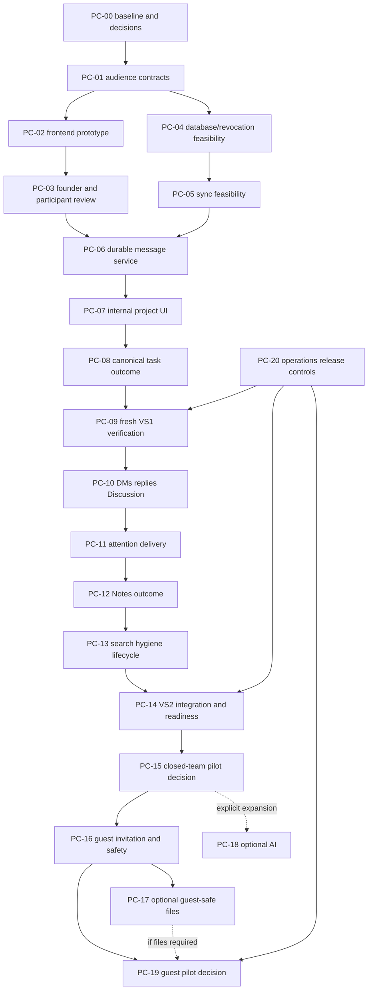

# Delivery backlog

12 September 2026 · **Planning complete; every implementation task below remains unstarted and gated.**

Scope authority: [decisions](decisions.md). Technical interfaces, permission invariants and proposed modules: [technical plan](technical-plan.md). Test IDs, experiments and gates: [verification-release](verification-release.md). Model IDs/settings and budget rules: [orchestration](agent-orchestration.md).

## Execution shape

First complete backend vertical slice **VS1**: an eligible adult Project member opens the explicitly scoped project conversation, sees the audience, sends text, another member retrieves it, both can leave and return, uncertain sends recover without duplicates, revocation denies future retrieval, and a message creates one canonical dated task with a safe source reference. This is the minimum complete coordination loop. Basic receipts/quiet attention and failure states are included; optional refinements do not block proving it.

Second vertical slice **VS2**: two consenting members start a Project-scoped private DM, reply in one-level threads, return to directed attention, save a reviewed outcome to their own Notes and search it in its proper domain, without hidden replies being marked read or broader work leaking private text. Integrate canonical task Discussion without duplicating it. These are proposed adult-team capabilities, not authorization to run a real pilot.

Critical path is audience decision → prototype comprehension + access/sync feasibility → integrated VS1 → VS2 → privacy/support/readiness → adult-team pilot. Definition and read-only audit have moved ahead of the reports' G1 sequence by explicit founder request; implemented spikes still wait for EXECUTE. PC-04/05 may run alongside prototype review after EXECUTE because they use isolated synthetic fixtures, but PC-06 integration waits for G1. No broad shell redesign, Space hierarchy, Project Drive or AI dependency.

Safe lanes after permission: one writer for current vertical slice; a read-only verifier can inspect a frozen commit; Luna may inventory exact files or prepare a specified fixture in an isolated worktree while Sol handles an unrelated component. Never overlap schema/lockfile/authorization/route owner edits. Integrator owns shared contracts and resolves differences before the next slice. A narrow review can overlap useful independent work, never acceptance of its own changing target.

## Common task contract (applies to every row)

All implementation packets are **held until EXECUTE**, scope approval and named dependencies. Status is proposed, not committed founder scope. Each task inherits:

- Baseline from STATE, fresh status/AGENTS check, exact IDs and closed dependencies. Allowed actions: approved local source/docs/test edits in a task worktree; synthetic local data only. No external sends, production, destructive operations, spending or dependency changes without the applicable gate.
- Non-goals: no unrelated cleanup, no broader hierarchy, no cross-workspace federation, no pupil messaging, no AI dependency, no transcript duplication. Interfaces are the technical plan's authoritative contracts; worker cannot redesign permissions or durable-send semantics.
- Evidence: changed paths and commit/working diff hash, exact commands/results, fixture description, screenshots for UI, one concise limitation list. Missing/skipped checks remain unverified. A source regex test never establishes runtime security.
- Reviewer: Sol for routine/UI changes plus founder design acceptance; Astra for identity, transactions, lifecycle, migrations and release readiness. Verification author must be fresh to the implementation where feasible. Founder remains owner of audience/privacy/spend/live release gates.
- Recovery: preserve unrelated work. Revert only owned application commits in the task branch; data changes use additive-compatible rollback, never dropping acknowledged history. Keep failed-operation custody and request IDs through retries. Individual recovery additions appear below.
- Completion: outcome demonstrated, listed acceptance checked against final integrated state, reviewer disposition recorded, STATE/decisions updated; not merely code written. One focused correction maximum after failed acceptance, then diagnose cause and replan. Budgets are advisory, not runtime enforcement.

Effort units: **S** one bounded file/contract lane; **M** several connected modules plus meaningful tests; **L** cross-domain state machine/review; **XL** evidence-dependent pilot/operational program. These are relative sizes, not agent hours/calendar estimates. No credible delivery date or spend estimate exists yet.

## First two slices: dispatch-level tasks

### PC-00 — Freeze current baseline and approved choices

Outcome: rebase the evidence onto the chosen local integration commit, preserve concurrent architecture work, resolve D-PC01–04/08. Sources WP01/WP05, D01/D04/D08/D11. Files: this directory, `docs/adr/0001-canonical-project-identity.md` read-only, current Project interfaces. Depends on founder plan review; risk medium, S, uncertainty medium. **Luna low** extracts exact changed references, **Astra high** resolves material drift. No migrations/implementation. Acceptance: git identity/status and relevant diff captured, no second Project identity, proof that selected base includes required fixes. Evidence: source-reference delta and decision record; reviewer integrator. Recovery: discard stale packet, preserve all code. Done when target commit and owner are explicit.

### PC-01 — Authorization and data contracts

Outcome: freeze transaction/ACL epoch/read/receipt contracts and executable negative fixture definitions before schema coding. Sources WP01/WP05/WP06; T01–T07/T12; R02–04. Files: proposed `src/lib/conversations/contracts.ts`, proposed `src/server/conversations/authorization.ts`, schema/ledger proposals, exact existing membership writers; definitions may initially remain in docs. Depends PC-00. Risk critical, M, high uncertainty; **Astra high**, because SQL serialization and Project/DM participation cannot be delegated to mechanical implementation. Interface: exact resource authorization with transaction executor and enforced archive policy. Bound: conversations only; no general authorization rewrite. Acceptance: matrix includes direct SQL grants/removals, account erasure, null-tenant tasks, blocked/consent paths, old sessions, duplicate keys; all refusal paths separate from empty success internally. Fresh Astra/Sol-high review tests the contract independently. Recovery: no committed schema yet; amend contract before dependent work. Done only when EX-01 test oracle is unambiguous.

### PC-02 — Frontend-only signature journey prototype

Outcome: demonstrate A/B/C/E/F, solo and future guest audience flow using synthetic local data. Sources WP02/WP03; T12–17/T19/T22/T23. Files: proposed messages components/fixture route, scoped Studio rail adapter, `product-workspace-shell.tsx`; no DB/services. Depends PC-01. Risk medium, M, medium uncertainty; **Sol medium** for component/state implementation, **Luna low** for specified fixtures only. Interfaces: `ConversationPanel`, `AudienceHeader`, `Composer`, `WorkActionForm` contract in technical plan, mocked typed service. Non-goal: shell redesign or real membership. Acceptance: switch panel/full view/projects with draft retained; block send after audience change; uncertain retry remains one row; no hidden-read clearing; 390px/1440px, zoom/keyboard/IME/reduced-motion review. Evidence: synthetic marker, browser screenshots, console, automated assertions; founder reviews design. Recovery: fixture-only route/flag removal. Done when reviewable full state inventory exists, not design-locked.

### PC-03 — Human design and formative review gate

Outcome: founder direction choice and recorded comprehension evidence. Sources WP04; D02/D03/D05; R01/R05/R06. Files: this directory's evidence references and decisions; no product edits. Depends PC-02. Risk high, XL, uncertainty high; **Astra medium** prepares test/review findings; founder recruits/consents approximately ten adult participants. Budget one study plus targeted retest, not unlimited polish. Acceptance: at least 8/10 unaided per core journey proposed; any dangerous audience confusion triggers revision irrespective of average. Distinguish founder approval, automated tests and actual participants. If participants unavailable, record blocked G1, do not fabricate validation or proceed to backend integration absent an explicit amended gate. Recovery: revise only affected prototype flow. Done when gate disposition is documented.

### PC-04 — Transaction and revocation feasibility (EX-01)

Outcome: prove same-store durable source/change/outbox atomicity, committed ordering and post-revoke denial. Sources WP05/WP06; T01–07/T12/T24. Files: isolated `work/` test harness, proposed conversation store/schema migration, `project-authz.ts` executor seam, membership triggers/fixtures. Depends PC-01 and EXECUTE; may overlap PC-02. Risk critical, L, high uncertainty; **Sol high** implements specified harness; **Astra high** accepts invariant evidence. Use a new isolated file DB; remote Turso/Clerk test proof needs explicit suitable environment, no production contact. Acceptance: force crash before/after commit, two-client sends/revokes, raw membership SQL, stale replica probe, tombstone replay, 10,000 duplicate retries; zero duplicate committed request effects or newly committed disclosure. Prove FK/trigger enforcement. Recovery: disposable synthetic DB only; keep harness evidence. Done when local results and separately unverified remote claims are recorded; remote-specific gate cannot be silently passed locally.

### PC-05 — Shared-store synchronization feasibility (EX-02)

Outcome: prove fresh authorized polling across two Node instances and quantify cost. Sources WP05/WP08; T05–07/T24, report performance targets. Files: proposed sync route/client scheduler and isolated load fixtures. Depends PC-04. Risk high, M/L, high uncertainty; **Sol high**, fresh **Astra high** transport review. Interface: `syncConversation(afterChangeSeq)` same-snapshot primary authorization/content, 1-second visible polling hypothesis. No existing SSE content reuse or new broker purchase. Acceptance: current membership every request, no-store, two runtime instances, delayed/offline clients and 50 concurrent viewers; p95 send <=800ms, remote <=1.5s, no duplicate/lost acknowledged message under defined healthy profile, measured request/DB demand. Report failures without relaxing thresholds. Recovery: keep history API, disable scheduler; if fail, stop at broker/cost decision D-PC04, do not install a service. Done when route choice is evidence-supported.

### PC-06 — Durable internal conversation backend

Outcome: one project conversation, send/history/change replay and own edit/tombstone behavior. Sources WP06; T01–07/T12. Files: proposed domain/store/actions/routes, `src/server/db/schema.ts`, new ledger-backed forward migration and its receipts/tests; no guessed SQL sequence name. Depends PC-03/04/05, chosen environment. Risk critical, L, medium-high uncertainty; **Sol high**, **Astra high** fresh review. Interfaces exactly PC-01 including trigger coverage and outbox lease identity. Acceptance: duplicate ensure/send, changed-payload conflict, cross-tenant/root forgery, epoch mismatch, archived refusal, paginated edit replay; db contract + isolated runtime/concurrency suite. Evidence includes migration dry-run and data-preserving flag rollback. Recovery: disable sends, retain additive schema/receipts/history; no down-drop. Done when backend invariants pass and service returns only durable receipts.

### PC-07 — Internal Project conversation UI

Outcome: real backend behind internal allowlist, full/contextual view and recoverable composer. Sources WP07; T01/T12/T19/T22. Files: PC-02 components, proposed reducer, Messages route, Studio rail integration and `product-workspace-shell.tsx`. Depends PC-06 and accepted prototype. Risk medium, M, medium uncertainty; **Sol medium**, reviewer Sol plus founder on departures. Interface uses explicit Project IDs, service receipt/revision and session generation. No auto-sending on reconnect to a different account. Acceptance: E2E A/E/F, failed response reconciliation, keyboard/mobile/scroll preservation, revoked screen clears cached content, solo shell unchanged. Recovery: disable UI/sends while retaining history access route for support. Done when two synthetic adults can send and return without inconsistent state.

### PC-08 — One task from one discussion outcome

Outcome: create/link canonical task with reliable provenance and dates. Sources WP07; T16/T17; R04/R07. Files: `src/server/actions/tasks.ts` transactional core extraction into proposed Tasks service, proposed `work-links.ts`, existing task form/date helpers, task card. Depends PC-07. Risk high, L, medium uncertainty; **Sol high**, **Astra high** reviews transactional/source-audience changes. Interface: atomic task+link+operation receipt in Tasks DB, unchanged existing public action behavior. Bound: no Notes or public Timeline changes. Acceptance: lost acknowledgment returns same task and link; changed form/request conflict; forged destination/assignee rejected; task dates appear through existing Schedule/Calendar; only intentionally designated milestones enter Timeline. Commands: isolated new promotion test plus existing task-security/date/Timeline-source suites. Recovery: keep created task, reconcile link; no compensation deletion. Done when VS1 question-to-task journey works under failure.

### PC-09 — Fresh VS1 acceptance

Outcome: frozen VS1 validated by a fresh pass before building breadth. Sources WP06/WP07/WP12; T01–07/T12/T16/T17/T19/T22/T24 + X01–X08. Files read-only implementation/tests, this directory evidence; depends PC-08 and PC-20 internal controls. Risk critical, M; **Sol high** independent test execution, **Astra high** accepts high-risk residuals. No edits while reviewing. Acceptance: run independent transaction barriers, inspect source/SQL/caches, execute actual UI recovery, ensure no fixture success response in authenticated mode. One correction packet then rerun affected checks. Recovery: disable slice and return to owning task if invariant fails. Done when all VS1 blockers closed; no live pilot permission implied.

### PC-10 — Project DMs, replies and canonical Discussion

Outcome: exactly-two-person Project DMs plus one-level replies; Task Discussion adapter uses existing comments. Sources WP07; D04/D05, T02–05/T12–14. Files: proposed DM/participants service, messages/thread UI, existing `comments.ts`, comment schema/queries/feed. Depends PC-09 and D-PC01 approval. Risk high, L, high uncertainty; **Sol high**, **Astra high** for uniqueness/consent/membership/revision changes. Interfaces: unique sorted pair per Project, explicit participation, comment IDs retained, structured member mentions. Non-goal: cross-Project DMs, group DMs, comment mirroring. Acceptance: concurrent DM creation one pair, block/leave/removal both devices, no third participant, structured mention resolves real users, old comment links/history preserved and edits replay; dropped comment response, changed-payload conflict, cross-task root forgery, legacy nullable rows and archive/revoke races pass. Recovery: disable DM/reply entry; preserve records and legacy read compatibility. Done when two consenting adults and old task discussions share a coherent navigation model without duplicate records.

### PC-11 — One attention state and dependable delivery

Outcome: Messages/Inbox share directed events; preferences and delivery worker work through failures. Sources WP08; T07/T13–15/T23/T24. Files: proposed attention/delivery modules, existing Inbox adapter/notification settings, new conversation drain route and scheduler proposal. Depends PC-10. Risk high, L, high uncertainty; **Sol high**, fresh **Astra high** reviews disclosure and leases. Interface: immutable source event identity, disjoint observed ranges, lease token/provider idempotency. No broad rewrite of old task reminders or implicit real emails. Acceptance: hidden reply remains unread; mention+follow merged; multi-device read clear; quiet-hours/DST/mute; revoked queued event suppressed; missing provider config is not success; duplicate worker claims safe; source committed with drain never running still produces in-app attention; reader-private state is invisible to authors/owners/analytics; sink captures no private snippets. Recovery: pause drain, retain queue, reauthorize replay with original IDs. Done after deterministic sink proof and explicit live-provider gate recorded separately.

### PC-12 — Save to my Notes with recoverable provenance (EX-03)

Outcome: authored private note linked to source through reliable cross-store operation. Sources WP07; T16/T17/T21, D-PC02. Files: proposed work operation coordinator; `src/modules/notes/server/actions/notes.ts`, Notes receipt/schema adapter, note UI. Depends PC-11 and private Notes scope approval. Risk high, L, high uncertainty; **Sol high**, **Astra high** review. Interface: stable destination ID/hash and idempotent authorized Notes receiver; separate DBs, no fictitious transaction across both. Acceptance: inject failures before Notes insert, after insert before acknowledgment, before source-link finalize; one note or explicit needs_review if exact draft is unavailable; source edit/delete/revocation at each crash point; mismatch/forged actor refused; revoked source cannot be newly copied; failed filing explicitly Unfiled or review. Recovery: retain valid authored note and repair pending link; no destructive compensation. Done when both stores reconcile to one note or an honest needs_review/source_changed state, owner-only Notes search succeeds, and UI never calls private Notes shared.

### PC-13 — Search, hygiene and lifecycle (EX-05)

Outcome: permission-aware message search, reactions, archive/restore, deletion/export and account cleanup. Sources WP07/WP08/WP12; T04/T09/T19/T21. Files: proposed search and lifecycle modules; existing account-erasure/export adapters; message UI; FTS migration if approved by feasibility. Depends PC-12. Risk high, L, high uncertainty; **Sol high**, **Astra high** accepts lifecycle. Interfaces: canonical source joins, no cached snippet/count leaks, retention policy and tombstones. Bound: no semantic search or attachments. Acceptance: 10k-message accessible corpus p95<=1s on named profile; foreign/removed/deleted results absent, special queries safe; project duplication omits chat; erasure replay preserves unfinished custody and clears index/queue. Recovery: disable search, rebuild index from authorized canonical data; preserve source history according to approved policy. Done when lifecycle inventory matches actual storage/derivatives.

### PC-14 — VS2 integrated readiness

Outcome: complete closed-adult-team candidate with tested scope/attention/private outcomes. Sources WP09/WP12; all internal T tests. Files: integrated candidate plus evidence in this package, policy text; depends PC-13/20 and founder retention/admin/support decisions. Risk critical, L; **Sol high** runs acceptance, **Astra high** milestone review, founder accepts remaining product risk. Tests: auth/concurrency, E2E A/B/C/E/F, a11y/browser matrix, notification sink, failure injection and migration rollback on one final commit. No production. Recovery: sends off, history preserved, operational replay rehearsal. Done when G3 readiness packet is truthful and all relevant stop-line conditions closed.

## Later actionable stages (still proposed)

All common task fields above apply. Details depend only on the stated evidence gate, not unexplained TBDs.

| ID / outcome and source | Files / interfaces | Dependencies; size, risk, model/effort | Acceptance, evidence, reviewer / recovery / done |
|---|---|---|---|
| **PC-15** Closed adult-team pilot and expansion decision. WP09/WP12; R01/05/06/09/13/14 | This package, server allowlist proposal, minimised operational events; no hidden message analytics | PC-14 plus explicit deployment/data/participant authorization; XL/high; Sol medium analysis, founder accountable | 3–5 adult teams, actual coordination cycles, baseline chasing/interruption interviews, support and cost per active Project; founder accepts or reshapes. Stop invites/sends if access/data loss; retain history/support. Done when pilot evidence and next scope decision recorded, not message-volume target reached. |
| **PC-16** Guest acceptance/history/abuse (EX-04). WP10; T05–12/T19/T23 | Proposed guest invitation/participant/block/report modules and focused landing; Clerk flow adapter; hashed tokens | PC-15 review, D06/D09/D10 decisions, explicit guest-build approval; L/critical; Sol high, Astra high review | Atomic verified-email acceptance, scanner/forwarded link/wrong account/replay/revoked inviter/expanded epoch tests; no workspace membership. Rate/block/report operator workflow, browser fallback. Revoke invitations and disable guest sends without deleting history. Done when synthetic guest G4 security and comprehension candidate passes. |
| **PC-17** Guest-safe attachments if needed. WP10; T08/T18/T21 | Existing storage/upload/download wrappers plus new association/quarantine/scan-state contract; no Project Drive dependency | PC-16, file use case and scanner/provider spend choice; L/critical; Sol high implementation, Astra high review | Malicious/oversize/signature mismatch quarantined; revoked guest download denied; no bearer bypass, sniffed safe content headers, orphan cleanup/replay. Evidence includes isolated storage/provider tests. Disable new uploads, preserve accepted files and controlled retrieval. Done only when secure file gate passes; otherwise text-only guest scope must be explicit. |
| **PC-18** Optional scoped AI evaluation. WP11; T20 | Proposed scoped retrieval/summary cache and source version adapter; existing AI integration assessed separately | Useful PC-15 evidence and explicit G5 scope/spend approval; L/high; Sol high, Astra high acceptance | No unauthorized/revoked source, malicious instructions ineffective, no autonomous task/invite, factual source/date/owner evaluation with model/cost receipts. Disable AI, invalidate summaries, keep chat intact. Done when approved evaluation rules pass; never blocks internal messaging. |
| **PC-19** Guest pilot/release evidence. WP10/WP12; R02/03/08/10/11 | Guest candidate/policy/operator evidence, scoped allowlist | PC-16 and PC-17 if use case requires files, privacy/retention/commercial and actual provider gates; XL/critical; Sol medium analysis, Astra high technical review, founder final | Unaided invite-to-useful-reply, correct audience explanation, real supported-device delivery, abuse response rehearsal and cost. Stop new guest participation on disclosure/abuse failures; retain authorized history/revoke safely. Done after explicit founder review of separate guest cohort. |
| **PC-20** Release/operations/rollback controls maintained per slice. WP12; T07/T21/T24 | Flags, metadata logs, isolated environment checks, migration ledger receipts, queue operator runbook; proposed schedule configuration only until release | PC-01 starts contracts; integrate with PC-06/11/13 for respective gates; M→L/high; Sol high, Astra high release reviewer | Verify missing config fails honestly; no body/token logs; queue stop/replay, data-preserving rollback, supported fresh-baseline upgrade/export fixtures. Founder names contact/support and retention before pilot. Application flags rollback first, no schema drop. Done at each stage only for that final candidate and environment. |

## Dispatch-ready packets

These are literal task starts after gating, not claims that agents have been dispatched. Actual effective model/effort must be recorded from runtime metadata when exposed; requested labels alone are not proof.

**Luna / PC-00 inventory:** Request `gpt-5.6-luna`, `low`, `fork_turns=none`. Baseline STATE. Objective: list membership writers and changed contract references since the evidence commit. Read only `src/server/actions/settings.ts`, `src/server/projects/service.ts`, `src/server/account-erasure.ts`, schema and matching `rg` results. No implementation/network/secrets. Output <=700 words plus exact paths/lines. Budget <=12 tool calls/one pass. Acceptance: every INSERT/UPDATE/DELETE reference classified, test-only distinguished, no guessed symbol. Escalate missing baseline or unexpected ownership to integrator. Return evidence and usage if exposed.

**Sol / PC-07 implementation:** Request `gpt-5.6-sol`, `medium`, `fork_turns=none`. Start only with PC-03/06 closed, explicit EXECUTE, frozen service contracts, isolated owned worktree. Allowed files: messages components/reducer/route plus agreed shell adapter; no schema/auth edits. Implement audience header, message list, composer/recovery and scoped draft continuity using accepted prototype. Acceptance commands: focused reducer tests, scoped type/lint, Playwright VS1 script with synthetic backend; no external provider. Budget one coherent packet, <=25 tool calls before checkpoint, one correction. Stop on API ambiguity or permission drift; report changed files/screenshots/tests/risk. Reviewer Sol; Astra only for discovered high-risk issue.

**Astra / PC-04 decision review:** Request `gpt-6-astra`, `high`, `fork_turns=none`. Read frozen migration/store/authorization and EX-01 results, not full report history. Objective: find counterexample to primary transaction/ACL/retry invariants. Read-only; use synthetic harness only after verifying environment. Acceptance: barriers prove both send-before-revoke and revoke-before-send, raw writer epoch coverage, stale-read refusal and foreign-key guarantees. Budget <=20 calls, <=1200-word verdict, one review. Return pass/fail/blocked with reproducible evidence, no security-certification claim. Stop dependents on any disclosure/lost receipt.

**Fresh verifier / PC-09:** Request `gpt-5.6-sol`, `high`, `fork_turns=none`; agent must not be PC-06/08 author. Packet includes final commit/hash, isolated fixture startup, exact acceptance file list and test oracle T01–07/T16–17/X01–08. Read-only source, generated output only in work directory. Independently simulate response loss after commit and membership removal before replay; inspect resulting DB cardinality and browser state. Budget <=25 calls/one correction returned to author. Report exact commands, outcomes, limitations and remaining high-risk acceptance for Astra. No score panel or duplicated full implementation.

## Founder involvement and capacity

Founder decisions concentrate at plan scope, prototype direction/comprehension, remote test environment/cost, retention/admin/support, and each real pilot/release. Routine accepted components, tests and recovery fixes do not need new approval. Budget defaults in orchestration cap work shape, not money. Before PC-06 commitment, use EX-01/02 measured effort and findings to estimate remaining L tasks; before PC-15 set a real cash and weekly founder-support ceiling. Infrastructure availability, study recruitment, identity test accounts and provider activation are external dependencies; agent runtime does not predict their calendar duration.
